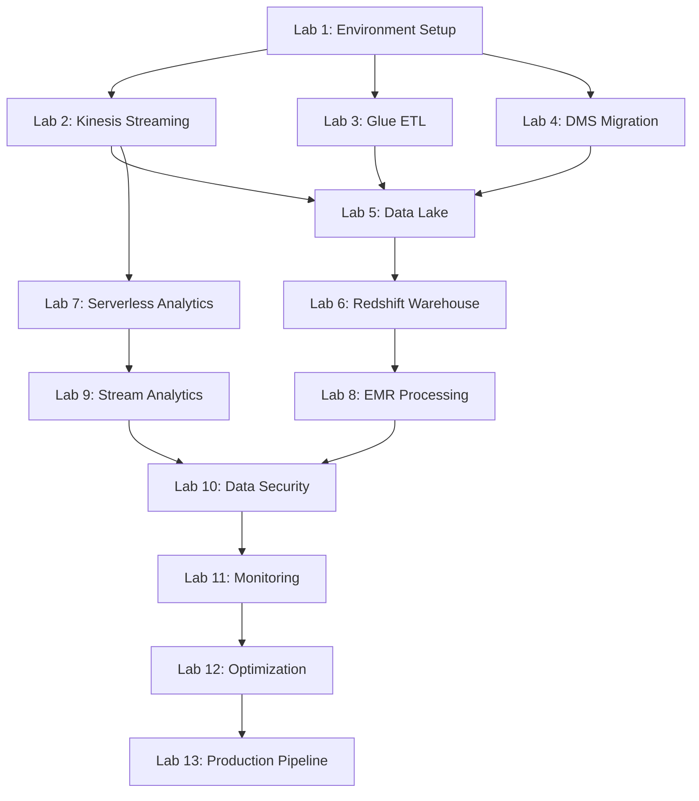

# Hands-On Labs: AWS Data Engineering

Practical, hands-on exercises to reinforce your learning and gain real-world experience with AWS data engineering services. These labs are designed to build upon each other, progressing from basic concepts to advanced implementations.

## 🎯 Lab Objectives

By completing these labs, you will:
- Gain practical experience with key AWS data services
- Build end-to-end data pipelines
- Implement security and monitoring best practices
- Optimize for performance and cost
- Troubleshoot common data engineering challenges

## 🔧 Prerequisites

### AWS Account Setup
- Active AWS account with appropriate permissions
- AWS CLI installed and configured
- Basic understanding of AWS console navigation

### Technical Requirements
- Python 3.8+ installed locally
- Basic SQL knowledge
- Command line familiarity
- Text editor or IDE (VS Code recommended)

### Cost Considerations
- Most labs use AWS Free Tier eligible services
- Estimated total cost for all labs: $20-50 USD
- Clean up resources after each lab to minimize costs

## 📚 Lab Overview

### Foundation Labs (Labs 1-4)
Build core data engineering skills with individual AWS services

### Integration Labs (Labs 5-9)  
Combine multiple services to create comprehensive data pipelines

### Advanced Labs (Labs 10-13)
Implement production-ready solutions with security, monitoring, and optimization

## 🧪 Lab List

### Lab 1: [Setting Up Your Data Engineering Environment](lab-01-environment-setup/README.md)
**Duration**: 45 minutes  
**Services**: AWS CLI, S3, IAM  
**Objectives**: Configure your development environment and create essential AWS resources

### Lab 2: [Real-Time Data Streaming with Kinesis](lab-02-kinesis-streaming/README.md)
**Duration**: 90 minutes  
**Services**: Kinesis Data Streams, Kinesis Data Firehose  
**Objectives**: Create streaming data pipelines for real-time data ingestion

### Lab 3: [ETL with AWS Glue](lab-03-glue-etl/README.md)
**Duration**: 120 minutes  
**Services**: AWS Glue, S3, Athena  
**Objectives**: Build serverless ETL pipelines with data cataloging

### Lab 4: [Database Migration with DMS](lab-04-dms-migration/README.md)
**Duration**: 90 minutes  
**Services**: AWS DMS, RDS, S3  
**Objectives**: Migrate databases with minimal downtime using DMS

### Lab 5: [Data Lake Architecture](lab-05-data-lake/README.md)
**Duration**: 120 minutes  
**Services**: S3, Glue, Athena, QuickSight  
**Objectives**: Build a complete data lake solution with analytics capabilities

### Lab 6: [Data Warehouse with Amazon Redshift](lab-06-redshift-warehouse/README.md)
**Duration**: 90 minutes  
**Services**: Amazon Redshift, S3, Glue  
**Objectives**: Create and optimize a cloud data warehouse

### Lab 7: [Serverless Analytics Pipeline](lab-07-serverless-analytics/README.md)
**Duration**: 120 minutes  
**Services**: Lambda, Kinesis, DynamoDB, CloudWatch  
**Objectives**: Build a fully serverless data processing pipeline

### Lab 8: [Big Data Processing with EMR](lab-08-emr-processing/README.md)
**Duration**: 150 minutes  
**Services**: Amazon EMR, S3, Spark  
**Objectives**: Process large datasets using managed big data frameworks

### Lab 9: [Stream Processing with Kinesis Analytics](lab-09-stream-analytics/README.md)
**Duration**: 90 minutes  
**Services**: Kinesis Data Analytics, Kinesis Data Streams  
**Objectives**: Implement real-time stream processing and analytics

### Lab 10: [Data Security and Encryption](lab-10-data-security/README.md)
**Duration**: 120 minutes  
**Services**: KMS, IAM, S3, RDS  
**Objectives**: Implement comprehensive data security measures

### Lab 11: [Monitoring and Troubleshooting](lab-11-monitoring/README.md)
**Duration**: 90 minutes  
**Services**: CloudWatch, CloudTrail, X-Ray  
**Objectives**: Set up monitoring and troubleshooting for data pipelines

### Lab 12: [Performance Optimization](lab-12-optimization/README.md)
**Duration**: 120 minutes  
**Services**: Redshift, Athena, Glue  
**Objectives**: Optimize data pipelines for performance and cost

### Lab 13: [End-to-End Production Pipeline](lab-13-production-pipeline/README.md)
**Duration**: 180 minutes  
**Services**: Multiple AWS services  
**Objectives**: Build a production-ready, end-to-end data pipeline

## 📊 Lab Progression

## 🎯 Learning Path Recommendations

### For Beginners
Follow the labs in sequence (1-13) for a structured learning experience

### For Experienced Developers
- Skip to specific labs based on your needs
- Focus on advanced labs (10-13) for production considerations

### For Certification Preparation
- Complete all labs to gain comprehensive hands-on experience
- Pay special attention to labs covering heavily weighted exam domains

## 📋 Lab Guidelines

### Before Starting Each Lab
1. Read the entire lab instructions
2. Understand the learning objectives  
3. Check prerequisites and costs
4. Prepare your development environment

### During Each Lab
1. Follow instructions step-by-step
2. Take screenshots of key configurations
3. Test each step before proceeding
4. Make notes of any issues or insights

### After Completing Each Lab
1. Verify all objectives were met
2. Clean up resources to avoid charges
3. Document lessons learned
4. Complete the lab review questions

## 💰 Cost Management

### Free Tier Utilization
Most labs are designed to use AWS Free Tier eligible services where possible

### Cost Monitoring
- Set up billing alerts before starting
- Monitor costs regularly during labs
- Clean up resources immediately after completion

### Resource Cleanup Checklists
Each lab includes detailed cleanup instructions to ensure no unexpected charges

## 🔍 Troubleshooting

### Common Issues
- IAM permissions problems
- Region consistency issues  
- Resource naming conflicts
- Network connectivity problems

### Getting Help
- Check lab-specific troubleshooting sections
- Review AWS service documentation
- Use AWS support forums
- Join the course discussion community

## 📈 Progress Tracking

Track your lab completion:

| Lab | Status | Completion Date | Key Insights |
|-----|--------|----------------|--------------|
| Lab 1 | ⬜ | ______ | __________ |
| Lab 2 | ⬜ | ______ | __________ |
| Lab 3 | ⬜ | ______ | __________ |
| Lab 4 | ⬜ | ______ | __________ |
| Lab 5 | ⬜ | ______ | __________ |
| Lab 6 | ⬜ | ______ | __________ |
| Lab 7 | ⬜ | ______ | __________ |
| Lab 8 | ⬜ | ______ | __________ |
| Lab 9 | ⬜ | ______ | __________ |
| Lab 10 | ⬜ | ______ | __________ |
| Lab 11 | ⬜ | ______ | __________ |
| Lab 12 | ⬜ | ______ | __________ |
| Lab 13 | ⬜ | ______ | __________ |

## 🔗 Next Steps

Ready to start? Begin with [Lab 1: Setting Up Your Data Engineering Environment](lab-01-environment-setup/README.md)

After completing all labs, proceed to the [Capstone Projects](../projects/README.md) to integrate everything you've learned.

---

*Remember: Hands-on experience is invaluable for both real-world application and exam success!* 🚀